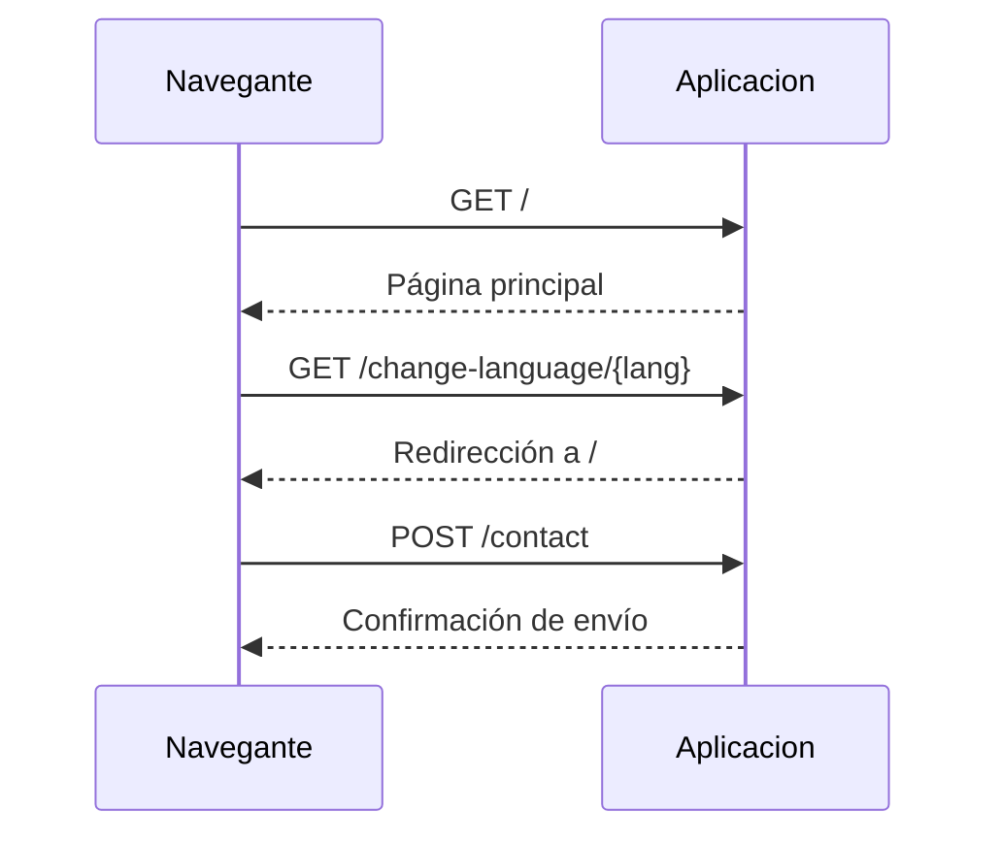

# Portafolio Personal con FastHTML

## \U0001F4D8 ¿Qué hace este proyecto?
Este repositorio implementa un sitio web de portafolio personal utilizando la biblioteca **FastHTML**. Su finalidad es mostrar datos biográficos, habilidades técnicas, proyectos y una sección de contacto. El código genera páginas HTML de forma dinámica a partir de archivos JSON en dos idiomas (`data.json` para español y `data_en.json` para inglés). 

Cuando el servidor se ejecuta, expone la ruta principal `/` con todo el contenido del portafolio. También ofrece `/change-language/{lang}` para alternar entre idiomas y la ruta `/contact` para procesar envíos del formulario de contacto. Las peticiones a `/contact` sólo registran la información recibida en la consola y devuelven un mensaje de confirmación al usuario; no hay persistencia adicional.

El frontend incluye un script (`static/script.js`) que habilita funciones de interfaz como la navegación móvil, la selección de idioma, la descarga del CV y el envío del formulario mediante un enlace `mailto`. Todo el diseño y las animaciones se definen en `static/styles.css`.

Además del código de la aplicación, el repositorio contiene un flujo de integración continua en `.github/workflows/cli.yml`. Dicho workflow construye una imagen Docker con `Dockerfile.deploy`, la publica en el registro de contenedores de DigitalOcean y, tras el push, ejecuta un script de despliegue remoto usando `appleboy/ssh-action`.

## \u2699\ufe0f ¿Cómo lo hace? (Paso a paso técnico)
1. **Inicialización** (`src/main.py`)
   - Se crea la aplicación con `fast_app()` y se monta `/static` para servir recursos estáticos.
   - Se cargan `data.json` y `data_en.json` en memoria. Una variable global `current_language` determina qué conjunto de datos se utiliza.
2. **Rutas**
   - `@rt("/")` ejecuta `home_view`, que construye la página principal combinando componentes: barra lateral, secciones de experiencias, habilidades, proyectos y formulario de contacto.
   - `@rt("/change-language/{lang}")` actualiza la variable `current_language` si `lang` es `es` o `en` y redirige a `/`.
   - `@rt("/contact")` recibe los campos `name`, `email`, `subject` y `message`; los imprime en consola y devuelve una vista de confirmación.
3. **Componentes HTML**
   - Las funciones `sidebar`, `main_content`, `moments_section`, `skills_section`, `projects_section` y `contact_section` generan cada bloque de la página utilizando los datos JSON.
   - `footer_section` añade enlaces a redes sociales y créditos.
4. **JavaScript del cliente** (`static/script.js`)
   - Maneja el despliegue de menús en dispositivos móviles y escritorio.
   - Permite alternar el idioma, mostrar/ocultar descripciones extensas y enviar el formulario de contacto vía `mailto`.
5. **Arranque**
   - El archivo finaliza con `serve()`, que inicia un servidor Uvicorn en el puerto 9000.

## \U0001FAE9 Entradas y salidas del sistema
### Entradas
- **GET /**: devuelve la página del portafolio.
- **GET /change-language/{lang}**: acepta `es` o `en` para cambiar el idioma.
- **POST /contact**: espera `name`, `email`, `subject` y `message`.
- Archivos `static/data.json` y `static/data_en.json` con toda la información mostrada.

### Salidas
- Páginas HTML generadas con FastHTML.
- Recursos estáticos (imágenes, CSS, JS) desde `/static`.
- Mensajes en consola con el contenido del formulario de contacto.

## \U0001F501 Diagrama secuencial (Mermaid)


## \U0001F50D Explicación del diagrama
- **GET /** activa `home_view`, que compone la interfaz usando los datos del idioma actual.
- **GET /change-language/{lang}** ejecuta `change_language`; actualiza `current_language` y responde con una redirección.
- **POST /contact** invoca `contact_post`, imprime los datos y muestra un mensaje de éxito.

## \U0001F6E0\ufe0f Cómo usar este proyecto
1. Clonar este repositorio.
2. Instalar dependencias:
   ```bash
   pip install -r requirements.txt
   ```
3. Ejecutar la aplicación desde el directorio `src`:
   ```bash
   uvicorn main:app --reload --port 9000
   ```
4. Abrir `http://localhost:9000` en el navegador.
5. Opcionalmente, ejecutar con Docker:
   ```bash
   docker compose up --build
   ```

## \U0001F4E6 Dependencias y configuración
- Python 3.11
- Paquetes de `requirements.txt`:
  - `python-fasthtml`
  - `uvicorn`
- `Dockerfile.deploy` define la imagen para producción y expone el puerto 9000.
- `docker-compose.yml` monta el código en `/application` y puede cargar variables desde `envs/.env.docker` (archivo no incluido).
- El workflow de GitHub (.github/workflows/cli.yml) construye y publica la imagen en DigitalOcean y ejecuta un script remoto de despliegue.

